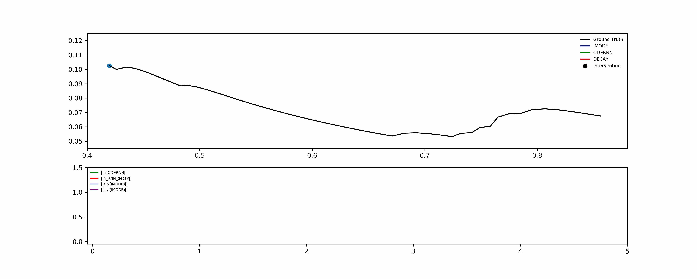

# Neural Ordinary Differential Equations for Intervention Modeling (IMODE)

This repository is the official implemtation of [Neural Ordinary Differential Equations for Intervention Modeling](https://arxiv.org/)

Real-world systems often involves external interventions that cause changes in the system dynamics such as a patient being administered with particular drug. We propose a novel neural ODE-based approach (IMODE) that properly model the effect of external interventions by employing two ODE functions to separately handle the observations and the interventions.

<p align="center">
  <b> A simulation of the trajectory in a 2D plane </b>
</p>

## Requirements
The below python3 packages are required to run the experiments.
```
torch
torchdiffeq
numpy
pandas
tqdm
matplotlib
```

## Running the model

### Exponential Decay
For training the model, 
```
python main_decay.py --exp-name decay_exp
```

For testing the trained model,
```
python main_decay.py --exp-name decay_exp --test-phase True
```
### Moving Ball
For training the model,
```
python main_collision.py --exp-name collision_exp 
```
For testing the trained model, 
```
python main_collision.py --exp-name collision_exp --test-phase True
```
### eICU
eICU Collaborative Research Database limits access by one who does not have a proper access, so the required training course must be completed prior to requesting access. Please see the following page to get the access <https://eicu-crd.mit.edu/gettingstarted/access/>.

For preprocessing eICU dataset, run **eICU_preprocessor.ipynb** in **datasets/eICU** folder.

For training the model, 
```
python main_eicu.py --exp-name eicu_exp
```
For testing the trained model,
```
python main_eicu.py --exp-name eicu_exp --test-phase True
```
